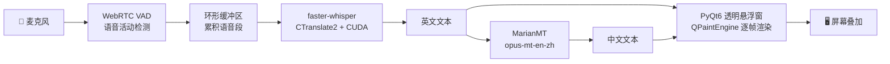
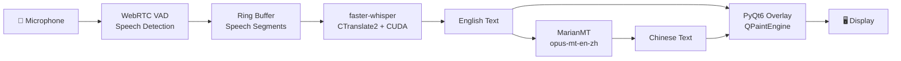

<div align="center">


# EchoCap

### 🎙️ 实时离线双语字幕叠加 · Real-time Offline Bilingual Caption Overlay

[](https://github.com/Saturn-shine/EchoCap/releases)
[](LICENSE)
[](https://github.com/Saturn-shine/EchoCap/releases)
[](https://github.com/Saturn-shine/EchoCap/releases)

</div>

---

<p align="center">
  <strong>说话即字幕 · 离线可用 · GPU 加速 · 虚拟声卡直播 · 零配置</strong>
  <br/>
  <sub>Speak → Whisper ASR → MarianMT Translation → Transparent Overlay → Live Stream</sub>
</p>

---

## 🌐 语言 / Language

**[中文](#-中文文档)** &nbsp;|&nbsp; **[English](#-english-docs)**

---

# 📖 中文文档

## 🤔 为什么是 EchoCap？

市面上不缺字幕工具。但 —

| 工具 | 痛点 |
|------|------|
| 🤖 云 API 方案 | 延迟高、要花钱、隐私泄露风险 |
| 🪟 Windows 自带 | 不支持实时翻译、不能自定义样式 |
| 🎬 OBS 插件 | 依赖在线服务、配置繁琐 |

**EchoCap 是唯一一个 ——**

- ✅ **完全离线**：ASR + 翻译全在本地跑，断网照样用
- ✅ **GPU 加速**：ctranslate2 + CUDA，RTX 3060 上延迟 <200ms
- ✅ **直播神器**：搭配虚拟声卡（VB-Cable / Voicemeeter），捕获系统音频实现 <300ms 端到端延迟的实时双语直播字幕
- ✅ **透明悬浮窗**：PyQt6 无边框窗口，置顶 + 穿透模式，不挡内容
- ✅ **即装即用**：安装包里塞了模型（~1.5GB），装完打开就说话
- ✅ **创作友好**：OBS 绿幕抠像、SRT 字幕导出、全局快捷键

> 💡 *简单说：把 OpenAI Whisper 的精度和 MarianMT 的翻译塞进一个 Windows 安装包，双击即用。*

## 🎬 效果预览

<p align="center">
  <em>（截图占位 — 运行 EchoCap 后按 Ctrl+Shift+C 复制字幕，截图替换此处）</em>
</p>

```
┌─────────────────────────────────────────────────────────┐
│  🎤 EchoCap                                       — □ ✕  │
│─────────────────────────────────────────────────────────│
│                                                         │
│  This is a real-time caption demo.                      │
│  这是一个实时字幕演示。                                    │
│                                                         │
│  [━━━━━━━━━━━━━━━━━━━━━━━━━] 70%  🎬  ⚙  🎨  ✕        │
└─────────────────────────────────────────────────────────┘
```

## ⚡ 快速开始

### 方式一：下载安装包（推荐）

从 [**GitHub Releases**](https://github.com/Saturn-shine/EchoCap/releases) 下载 `EchoCap_Setup.exe` → 双击安装 → 打开即用。

模型已内置，无需联网下载。

### 方式二：从源码运行

```bash
git clone https://github.com/Saturn-shine/EchoCap.git
cd EchoCap
pip install -r requirements.txt
python main.py
```

首次运行会自动从 HuggingFace 下载模型（~1.5GB）。国内网络不稳定可在设置中启用 HF 镜像。

## ✨ 功能一览

| 功能 | 说明 |
|------|------|
| 🎙️ **实时语音识别** | 基于 faster-whisper，CTranslate2 + CUDA GPU 加速，ASR 延迟 <200ms |
| 🌐 **实时英译中** | Helsinki-NLP/opus-mt-en-zh 离线翻译模型 |
| 🔌 **虚拟声卡兼容** | 搭配 VB-Cable / Voicemeeter 捕获系统音频，端到端延迟 <300ms |
| 🪟 **透明悬浮窗** | 始终置顶、无边框、可拖拽、可缩放 |
| 🖱️ **穿透模式** | 鼠标点击透过字幕窗口，不干扰其他操作 |
| ⌨️ **全局快捷键** | 在其他应用聚焦时也能用的系统级快捷键 |
| 🎨 **5 套配色主题** | 暗金 / 纯白 / 赛博绿 / 暖橙 / Nord 蓝 |
| 🎬 **OBS 绿幕抠像** | 绿/蓝色背景模式，直接 Chroma Key |
| 📋 **系统托盘** | 右键菜单：暂停、穿透、设置、导出 |
| 📝 **SRT 字幕导出** | 保存为 SubRip 格式，直接导入剪辑软件 |
| 🔲 **极简模式** | 紧凑单行字幕，适合直播 |
| 🚀 **开机自启** | 可选注册表 Run 键，打开电脑就用 |

## 🧠 技术架构



| 组件 | 技术选型 | 原因 |
|------|---------|------|
| **语音识别** | faster-whisper + CTranslate2 | 比原始 Whisper 快 4×，GPU 内存占用减半 |
| **翻译** | MarianMT (Helsinki-NLP) | Transformer 架构，EN→ZH 离线可用 |
| **VAD** | WebRTC VAD | 轻量级，40+ 语言通用 |
| **UI 框架** | PyQt6 | 原生 Windows 渲染，透明窗口支持好 |
| **音频采集** | sounddevice + PortAudio | 低延迟 WASAPI 环回 |
| **打包** | PyInstaller + Inno Setup | 单 exe + Windows 原生安装程序 |

## 🔧 快捷键

| 快捷键 | 操作 |
|--------|------|
| `Ctrl + Shift + P` | 暂停 / 继续 |
| `Ctrl + Shift + H` | 显示 / 隐藏窗口 |
| `Ctrl + Shift + C` | 复制当前字幕到剪贴板 |
| `Ctrl + Shift + T` | 切换中文翻译显示 |

> 💡 所有快捷键可在 **设置 → 快捷键** 中自定义。

## 🔊 虚拟声卡 + 低延迟直播

EchoCap 的核心亮点之一是**与虚拟声卡配合**，可以实现延迟极低的实时双语字幕翻译，是直播场景的杀手级功能。

### 工作原理

```
系统音频 / 浏览器 / 游戏 / 视频会议
         │
         ▼
   VB-Cable / Voicemeeter（虚拟音频设备）
         │
         ▼
   EchoCap 音频输入（WASAPI 环回采集）
         │
    ┌────┴────┐
    │  ASR    │  faster-whisper + CUDA  < 200ms
    ├─────────┤
    │  翻译    │  MarianMT EN→ZH        < 50ms
    └────┬────┘
         │
         ▼
   透明悬浮窗叠加 → OBS 采集 → 直播推流
```

### 配置步骤

1. 安装 [**VB-Cable**](https://vb-audio.com/Cable/)（免费）或 [**Voicemeeter**](https://vb-audio.com/Voicemeeter/)（高级混音）
2. 将系统音频输出路由到虚拟声卡
3. EchoCap **设置 → 音频 → 输入设备** 选择虚拟声卡的录制端
4. 开启 OBS 绿幕模式，叠加到直播画面

> ⚡ **性能基准**：RTX 3060 + VB-Cable，端到端延迟（语音 → 双语字幕）**< 300ms**，人耳几乎感知不到延迟。

## 🎬 OBS 配置

1. 添加 **窗口采集** → 窗口选 `[EchoCap]`
2. EchoCap 工具栏点击 **🎬** 开启绿幕模式
3. OBS 中对该窗口采集源添加 **色度键** 滤镜
4. 关键色匹配（绿：`#00FF00`，蓝：`#0000FF`）

## 📂 项目结构

```
EchoCap/
├── main.py               # 应用入口，流程编排
├── overlay.py            # 透明悬浮窗（PyQt6 QPaintEngine）
├── pipeline.py           # 流式 ASR + 翻译处理管线
├── asr_engine.py         # faster-whisper 封装（auto 设备/精度回退）
├── translator.py         # MarianMT 翻译封装
├── hotkeys.py            # Windows 全局热键（RegisterHotKey）
├── settings_dialog.py    # 设置对话框（5 个标签页）
├── tray_icon.py          # 系统托盘图标与菜单
├── app_icon.py           # 程序化麦克风图标
├── about_dialog.py       # 关于对话框 + 模型署名
├── export_srt.py         # 字幕 → SRT 转换器
├── update_checker.py     # GitHub Release 版本检查
├── config.py             # 配置 I/O + 默认值 + 自动修复
├── paths.py              # 跨平台路径解析（frozen ↔ dev）
├── logging_config.py     # 日志配置
├── prepare_models.py     # 模型瘦身脚本（构建用）
├── hooks/                # PyInstaller 自定义钩子
├── build_exe.bat         # 一键构建脚本
├── installer.iss         # Inno Setup 安装脚本
├── EchoCap.spec          # PyInstaller spec
├── requirements.txt      # Python 依赖
└── VERSION               # 版本号
```

## 🛠️ 构建安装包

```bash
# 前置：PyInstaller + Inno Setup 6
# 一键构建：
build_exe.bat

# 或分步：
pyinstaller --clean EchoCap.spec    # → dist/EchoCap.exe
python prepare_models.py            # → dist/models/
iscc installer.iss                  # → Output/EchoCap_Setup.exe
```

## ⚙️ 设置参考

| 标签页 | 可配置项 |
|--------|---------|
| **音频** | 输入设备、采样率、VAD 灵敏度、静音超时 |
| **ASR** | 模型路径、设备（auto/CUDA/CPU）、精度、HF 镜像 |
| **翻译** | 语言对、本地模型路径 |
| **界面** | 字号、颜色、透明度、淡出时间、字体、对齐、穿透 |
| **快捷键** | 四组全局快捷键，完全自定义 |

## 🏷️ 模型许可

| 模型 | 许可证 | 来源 |
|------|--------|------|
| faster-whisper-small (Systran) | MIT | 基于 OpenAI Whisper |
| opus-mt-en-zh (Helsinki-NLP) | [CC-BY-4.0](https://creativecommons.org/licenses/by/4.0/) | HuggingFace |

EchoCap 本体使用 **MIT** 许可证。

## 🤝 贡献

欢迎提 Issue 和 PR！

1. Fork 本仓库
2. 创建分支 (`git checkout -b feat/amazing`)
3. 提交修改 (`git commit -m "Add amazing feature"`)
4. 推送分支 (`git push origin feat/amazing`)
5. 提交 Pull Request

## ⭐ 星标历史

[](https://star-history.com/#Saturn-shine/EchoCap&Date)

## 🙏 致谢

- [faster-whisper](https://github.com/SYSTRAN/faster-whisper) — CTranslate2 加速的 Whisper 推理
- [Helsinki-NLP](https://huggingface.co/Helsinki-NLP) — 开源神经机器翻译模型
- [PyQt6](https://www.riverbankcomputing.com/software/pyqt/) — Python Qt 绑定
- [sounddevice](https://python-sounddevice.readthedocs.io/) — PortAudio Python 封装

---

> 由 [Saturn_shine](https://github.com/Saturn-shine) 用 ❤️ 和 🐍 构建

---

# 📖 English Docs

## 🤔 Why EchoCap?

The market has no shortage of caption tools. The problem:

| Tool | Pain Point |
|------|------------|
| 🤖 Cloud APIs | Latency, cost, data leaves your machine |
| 🪟 Windows native | No real-time translation, no customization |
| 🎬 OBS plugins | Online-dependent, complex setup |

**EchoCap is the only one that is —**

- ✅ **Fully Offline** — ASR + translation run locally. No internet, no problem
- ✅ **GPU Accelerated** — CTranslate2 + CUDA. <200ms latency on RTX 3060
- ✅ **Live Streaming Beast** — Pair with a virtual audio cable (VB-Cable / Voicemeeter) for sub-300ms end-to-end bilingual captions on stream
- ✅ **Transparent Overlay** — PyQt6 frameless window, always-on-top with click-through
- ✅ **Batteries Included** — Models bundled in the installer (~1.5 GB). Install → Speak
- ✅ **Creator-Ready** — OBS chroma key, SRT export, global hotkeys

> 💡 *Think of it as OpenAI Whisper + MarianMT, shrink-wrapped into a single Windows installer.*

## 🎬 Preview

<p align="center">
  <em>(Screenshot placeholder — run EchoCap, copy captions with Ctrl+Shift+C, and replace this)</em>
</p>

```
┌─────────────────────────────────────────────────────────┐
│  🎤 EchoCap                                       — □ ✕  │
│─────────────────────────────────────────────────────────│
│                                                         │
│  This is a real-time caption demo.                      │
│  这是一个实时字幕演示。                                    │
│                                                         │
│  [━━━━━━━━━━━━━━━━━━━━━━━━━] 70%  🎬  ⚙  🎨  ✕        │
└─────────────────────────────────────────────────────────┘
```

## ⚡ Quick Start

### Option 1: Pre-built Installer (Recommended)

Download `EchoCap_Setup.exe` from [**GitHub Releases**](https://github.com/Saturn-shine/EchoCap/releases) → double-click → done.

Models are bundled — no download needed on first launch.

### Option 2: Run from Source

```bash
git clone https://github.com/Saturn-shine/EchoCap.git
cd EchoCap
pip install -r requirements.txt
python main.py
```

On first run, models download automatically from HuggingFace (~1.5 GB). Set the HF mirror in Settings if your network is unstable.

## ✨ Features

| Feature | Description |
|---------|-------------|
| 🎙️ **Real-time ASR** | faster-whisper with CTranslate2 + CUDA GPU acceleration, <200ms ASR latency |
| 🌐 **EN→ZH Translation** | Helsinki-NLP/opus-mt-en-zh, fully offline |
| 🔌 **Virtual Audio Cable** | Capture system audio via VB-Cable / Voicemeeter, <300ms end-to-end |
| 🪟 **Transparent Overlay** | Always-on-top, frameless, draggable, resizable |
| 🖱️ **Click-through Mode** | Mouse passes through the overlay, no interference |
| ⌨️ **Global Hotkeys** | System-level shortcuts that work across all apps |
| 🎨 **5 Color Themes** | Dark Gold · Pure White · Cyber Green · Warm Orange · Nord Blue |
| 🎬 **OBS Chroma Key** | Green/blue background modes for instant chroma keying |
| 📋 **System Tray** | Right-click: pause, click-through, settings, export |
| 📝 **SRT Export** | SubRip format — drop straight into DaVinci / Premiere |
| 🔲 **Minimal Mode** | Compact single-line overlay for streaming |
| 🚀 **Auto-Start** | Optional Windows boot launch via registry Run key |

## 🧠 Architecture



| Component | Stack | Rationale |
|-----------|-------|-----------|
| **ASR** | faster-whisper + CTranslate2 | 4× faster than vanilla Whisper, half the VRAM |
| **Translation** | MarianMT (Helsinki-NLP) | Transformer-based, offline EN→ZH |
| **VAD** | WebRTC VAD | Lightweight, battle-tested across 40+ languages |
| **UI** | PyQt6 | Native Windows rendering, robust transparent windows |
| **Audio I/O** | sounddevice + PortAudio | Low-latency WASAPI loopback |
| **Packaging** | PyInstaller + Inno Setup | Single exe + native Windows installer |

## 🔧 Key Bindings

| Shortcut | Action |
|----------|--------|
| `Ctrl + Shift + P` | Pause / Resume |
| `Ctrl + Shift + H` | Show / Hide overlay |
| `Ctrl + Shift + C` | Copy caption to clipboard |
| `Ctrl + Shift + T` | Toggle Chinese translation |

> 💡 All hotkeys are customizable in **Settings → Hotkeys**.

## 🔊 Virtual Audio Cable + Low-Latency Streaming

EchoCap's killer feature is pairing with a virtual audio cable for **ultra-low-latency bilingual captions** — ideal for live streaming.

### Data Flow

```
System Audio / Browser / Game / Zoom
         │
         ▼
   VB-Cable / Voicemeeter（virtual audio device）
         │
         ▼
   EchoCap Audio Input（WASAPI loopback capture）
         │
    ┌────┴────┐
    │  ASR    │  faster-whisper + CUDA  < 200ms
    ├─────────┤
    │   MT    │  MarianMT EN→ZH        < 50ms
    └────┬────┘
         │
         ▼
   Transparent overlay → OBS capture → Live stream
```

### Setup

1. Install [**VB-Cable**](https://vb-audio.com/Cable/) (free) or [**Voicemeeter**](https://vb-audio.com/Voicemeeter/) (advanced mixing)
2. Route your system audio output to the virtual cable
3. In EchoCap **Settings → Audio → Input Device**, select the virtual cable's recording endpoint
4. Enable OBS chroma key mode and overlay onto your stream

> ⚡ **Benchmark**: RTX 3060 + VB-Cable — end-to-end latency (speech → bilingual captions) **< 300ms**, imperceptible to viewers.

## 🎬 OBS Setup

1. Add a **Window Capture** source → select `[EchoCap]`
2. Click **🎬** in the EchoCap toolbar to enable chroma key mode
3. In OBS, add a **Chroma Key** filter on the Window Capture source
4. Match key color (green: `#00FF00`, blue: `#0000FF`)

## 📂 Project Structure

```
EchoCap/
├── main.py               # App entry point & orchestration
├── overlay.py            # Transparent overlay (PyQt6 QPaintEngine)
├── pipeline.py           # Streaming ASR + translation pipeline
├── asr_engine.py         # faster-whisper wrapper (auto device/precision fallback)
├── translator.py         # MarianMT translation wrapper
├── hotkeys.py            # Global hotkeys (Win32 RegisterHotKey)
├── settings_dialog.py    # Settings dialog (5 tabs)
├── tray_icon.py          # System tray icon & menu
├── app_icon.py           # Programmatic microphone icon
├── about_dialog.py       # About dialog + model attribution
├── export_srt.py         # Caption → SRT converter
├── update_checker.py     # GitHub Release version checker
├── config.py             # Config I/O + defaults + auto-repair
├── paths.py              # Cross-platform path resolution (frozen ↔ dev)
├── logging_config.py     # Logging setup
├── prepare_models.py     # Model trimmer (build tool)
├── hooks/                # PyInstaller custom hooks
├── build_exe.bat         # One-click build script
├── installer.iss         # Inno Setup installer script
├── EchoCap.spec          # PyInstaller spec
├── requirements.txt      # Python dependencies
└── VERSION               # Version file
```

## 🛠️ Build the Installer

```bash
# Prerequisites: PyInstaller + Inno Setup 6
# One-click:
build_exe.bat

# Or step-by-step:
pyinstaller --clean EchoCap.spec    # → dist/EchoCap.exe
python prepare_models.py            # → dist/models/
iscc installer.iss                  # → Output/EchoCap_Setup.exe
```

## ⚙️ Settings Reference

| Tab | Options |
|-----|---------|
| **Audio** | Input device, sample rate, VAD sensitivity, silence timeout |
| **ASR** | Model path, device (auto/CUDA/CPU), compute type, HF mirror |
| **Translate** | Language pair, local model path |
| **UI** | Font sizes, colors, opacity, fade-out, font family, alignment, click-through |
| **Hotkeys** | All four global shortcuts — fully configurable |

## 🏷️ Model Licenses

| Model | License | Source |
|-------|---------|--------|
| faster-whisper-small (Systran) | MIT | Based on OpenAI Whisper |
| opus-mt-en-zh (Helsinki-NLP) | [CC-BY-4.0](https://creativecommons.org/licenses/by/4.0/) | HuggingFace |

EchoCap itself is licensed under **MIT**.

## 🤝 Contributing

Issues and PRs welcome!

1. Fork the repo
2. Create a branch (`git checkout -b feat/amazing-feature`)
3. Commit changes (`git commit -m "Add amazing feature"`)
4. Push (`git push origin feat/amazing-feature`)
5. Open a Pull Request

## ⭐ Star History

[](https://star-history.com/#Saturn-shine/EchoCap&Date)

## 🙏 Acknowledgments

- [faster-whisper](https://github.com/SYSTRAN/faster-whisper) — CTranslate2-accelerated Whisper inference
- [Helsinki-NLP](https://huggingface.co/Helsinki-NLP) — Open-source neural machine translation
- [PyQt6](https://www.riverbankcomputing.com/software/pyqt/) — Python Qt bindings
- [sounddevice](https://python-sounddevice.readthedocs.io/) — PortAudio Python wrapper

---

> Built with ❤️ and 🐍 by [Saturn_shine](https://github.com/Saturn-shine)
